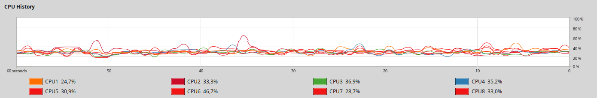
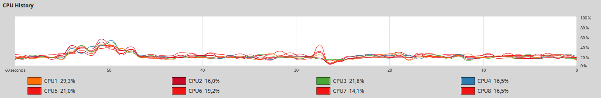
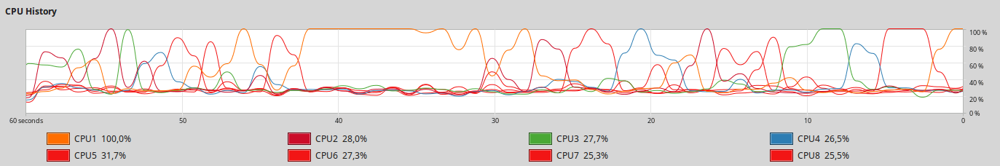
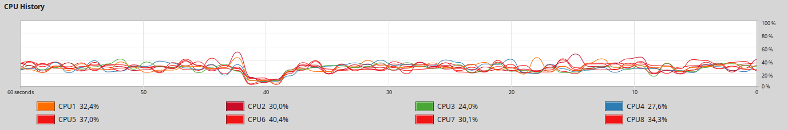

## Wyniki importu mojego zbioru danych 

[cols='1,1,2,2', options='header']
.Standalone 14.8mln
|===
|Nr próbki |Real |User |System
| 1  | 65.003 |96.391| 5.713
| 2  | 64.908 |95.492| 5.493
| 3  | 65.991 |95.759| 5.601
| 4  | 66.308 |97.520| 5.515
| 5  | 66.307 |95.778| 5.316
|Średnia|65.703|96.188|5.528
|===

Wykorzystanie procesora w trakcie importowania danych do bazy standalone.

Zmniejszyłem ilość danych do 100 tysięcy ze względu na ekstremalnie długie czasy importów.

[cols='1,1,2,2', options='header']
.Standalone  100k
|===
|Nr próbki |Real |User |System
| 1  | 0.644 |0.732| 0.058
| 2  | 0.629 |0.767| 0.053
| 3  | 0.645 |0.735| 0.079
| 4  | 0.642 |0.763| 0.049
| 5  | 0.658 |0.741| 0.068
|Średnia|0.644|0.748|0.061
|===
[cols='1,1,2,2', options='header']
.Replica set default
|===
|Nr próbki |Real |User |System
| 1  | 14.123 |3.064| 0.344
| 2  | 14.152 |3.338| 0.269
| 3  | 15.527 |3.230| 0.274
| 4  | 14.123 |3.281| 0.333
| 5  | 14.310 |3.187| 0.378
|Średnia|14.447|3.220|0.320
|===
[cols='1,1,2,2', options='header']
.Replica set writeConcern {w:1, j:false}
|===
|Nr próbki |Real |User |System
| 1  | 1.051 |0.703| 0.044
| 2  | 0.989 |0.702| 0.046
| 3  | 1.236 |0.769| 0.069
| 4  | 1.142 |0.697| 0.050
| 5  | 1.213 |0.751| 0.070
|Średnia|1.126|0.724|0.056
|===
[cols='1,1,2,2', options='header']
.Replica set writeConcern {w:1, j:true}
|===
|Nr próbki |Real |User |System
| 1  | 13.132 |3.007| 0.379
| 2  | 14.771 |2.997| 0.263
| 3  | 13.149 |3.064| 0.344
| 4  | 13.079 |2.565| 0.270
| 5  | 12.654 |3.018| 0.323
|Średnia|13.357|2.930|0.316
|===
[cols='1,1,2,2', options='header']
.Replica set writeConcern {w:2, j:false}
|===
|Nr próbki |Real |User |System
| 1  | 13.053 |2.997| 0.257
| 2  | 2.076 |0.228| 0.009
| 3  | 13.139 |2.759| 0.258
| 4  | 13.048 |2.826| 0.211
| 5  | 12.777 |2.633| 0.255
|Średnia|10.819|2.289|0.198
|===
[cols='1,1,2,2', options='header']
.Replica set writeConcern {w:2, j:true}
|===
|Nr próbki |Real |User |System
| 1  | 14.357 |3.239| 0.330
| 2  | 15.536 |2.664| 0.362
| 3  | 14.516 |3.296| 0.379
| 4  | 14.263 |3.232| 0.360
| 5  | 14.162 |3.238| 0.329
|Średnia|14.567|3.134|0.352
|===

Wykorzystanie procesora w trakcie importowania danych do bazy replica set.

Jak widać czas rzeczywisty potrafi być nawet czterokrotnie większy od czasu użytkownika. Związane jest to z liczbą fizycznych rdzeni procesora. Pomiar wykonany został na maszynie z procesorem czterordzeniowym.

## Wyniki importu danych adresowych Mazowsza

[cols='1,1,2,2', options='header']
.Standalone
|===
|Nr próbki |Real |User |System
| 1  | 25.714 |64.405| 3.276
| 2  | 25.690 |64.408| 3.312
| 3  | 25.756 |64.417| 3.294
| 4  | 26.012 |64.149| 3.325
| 5  | 25.905 |63.701| 3.499
|Średnia|25.815|64.216|3.341
|===

Wykorzystanie procesora w trakcie importowania danych do bazy standalone.

[cols='1,1,2,2', options='header']
.Replica set default
|===
|Nr próbki |Real |User |System
| 1  | 220.164 |203.954| 14.286
| 2  | 222.587 |202.423| 14.247
| 3  | 223.505 |202.907| 14.143
| 4  | 222.853 |198.636| 13.922
| 5  | 225.325 |195.571| 13.669
|Średnia|222.887|200.698|14.053
|===
[cols='1,1,2,2', options='header']
.Replica set writeConcern {w:1, j:false}
|===
|Nr próbki |Real |User |System
| 1  | 27.490 |61.797| 3.007
| 2  | 28.017 |61.383| 3.023
| 3  | 27.717 |61.847| 2.728
| 4  | 27.240 |61.513| 3.118
| 5  | 27.259 |61.343| 3.056
|Średnia|27.545|61.577|2.986

|===
[cols='1,1,2,2', options='header']
.Replica set writeConcern {w:1, j:true}
|===
|Nr próbki |Real |User |System
| 1  | 169.662 |208.963| 13.787
| 2  | 167.789 |211.135| 14.536
| 3  | 170.462 |213.600| 14.322
| 4  | 164.986 |202.516| 13.161
| 5  | 170.519 |211.746| 14.246
|Średnia|168.684|209.592|14.010
|===
[cols='1,1,2,2', options='header']
.Replica set writeConcern {w:2, j:false}
|===
|Nr próbki |Real |User |System
| 1  | 24.523 |24.808| 1.786
| 2  | 61.974 |66.110| 4.927
| 3  | 62.985 |68.313| 5.049
| 4  | 62.423 |64.837| 4.647
| 5  | 63.663 |66.236| 4.641
|Średnia|55.114|58.061|4.210
|===
[cols='1,1,2,2', options='header']
.Replica set writeConcern {w:2, j:true}
|===
|Nr próbki |Real |User |System
| 1  | 63.877 |56.744| 4.101
| 2  | 62.447 |57.077| 3.933
| 3  | 63.876 |58.255| 3.993
| 4  | 61.333 |56.837| 3.840
| 5  | 63.302 |57.831| 4.125
|Średnia|62.967|57.349|3.998
|===

Wykorzystanie procesora w trakcie importowania danych do bazy replica set.
